thymeleaf-dev

1.保存作用域
    
    原始情况下，有四个保存作用域：
    1) page         : 页面级别
    2) request      : 一次请求响应范围
客户端重定向：

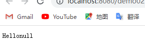
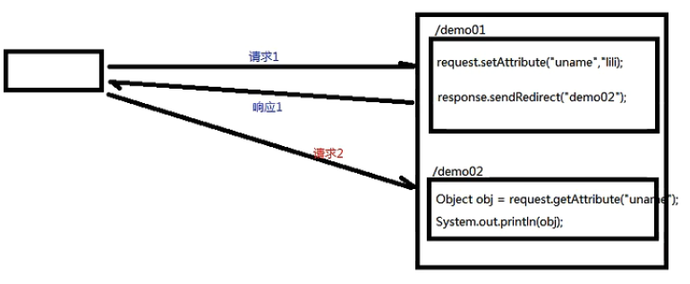
服务器内部转发：

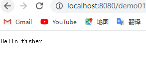

    3) session      : 一次会话范围
客户端重定向：

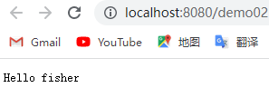

服务器内部转发：

    4) application  : 整个应用范围

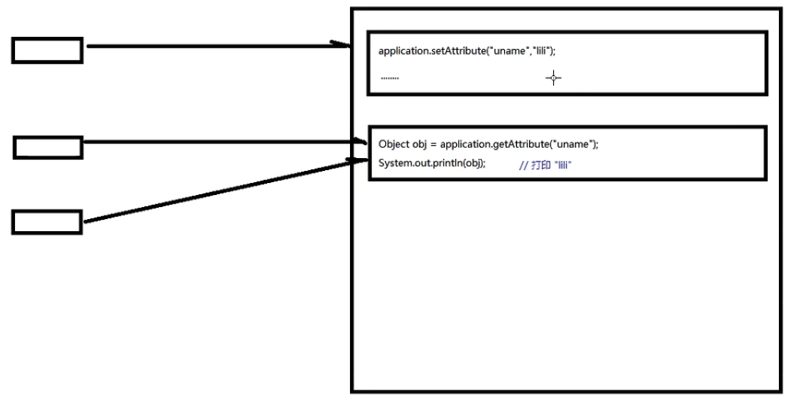

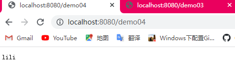

2.路径问题

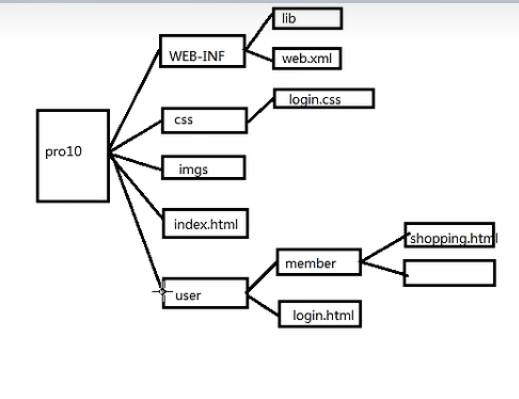
    
    1)相对路径
    上图中的login.html若引用login.css，路径为：../css/login.css
        ../表示上一级目录
        /表示当前目录等等
    2)绝对路径
    绝对路径的根目录：http://localhost:8080/webrrestart
        (协议:url:端口号/context-root)
    上图中的index.html的绝对路径为:http://localhost:8080/webrrestart/index.html
    
    html中的base标签：
        <base href="http://localhost:8080/webrrestart/" />
        作用当前页面上的所有路径都以href的值为基础。
    thymeleaf中 th:href="@{}"

当前业务逻辑：

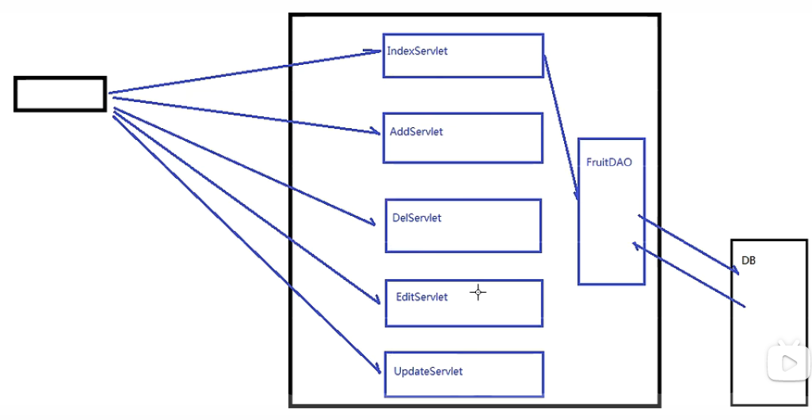

改进业务逻辑_01：(优化Servlet，多个转化为一个)

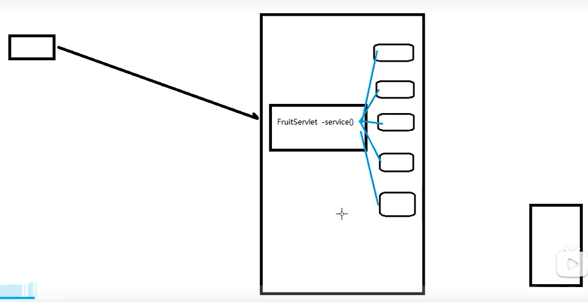

改进业务逻辑_02 (mvc reflect)

    通过反射(getClass().getDeclaredMethods())

改进业务逻辑_03 (mvc dispatcherServlet(调度))
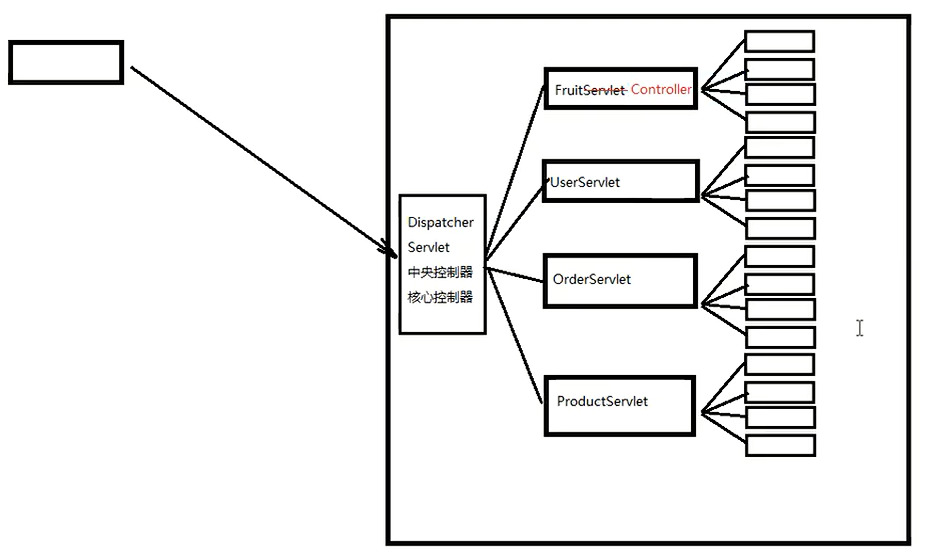

    为FruitServlet增加调度服务，判断是否需要使用FruitServlet
    
    若url为http://localhost:8080/fruit.do
    则ServletPath为:/fruit.do
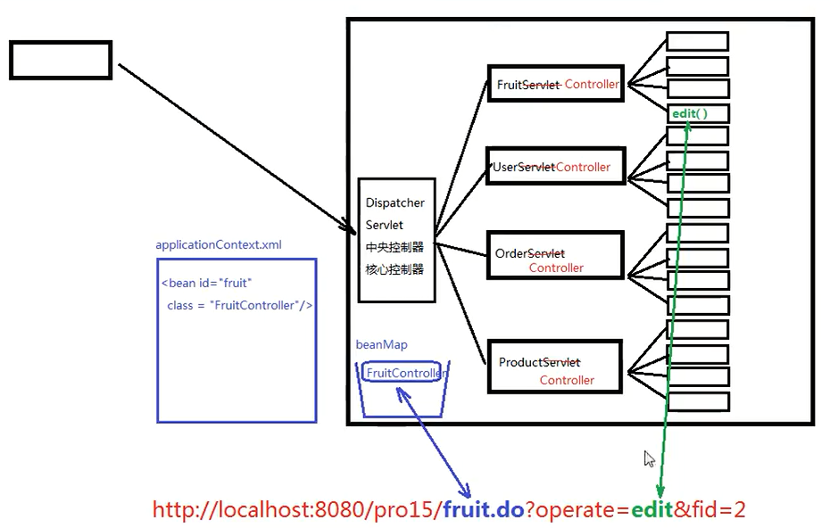
    
    DispatcherServlet类的工作分为两部分：
        1.根据url定位到能处理这个请求的controller组件
            1)从url中提取servletPath ： /fruit.do -> fruit
            2)根据fruit找到对应的FruitController，对应关系存储在applicationContext.xml中
                <bean id="fruit" class="com.fisher.fruit.controller.FruitController" />
                通过DOM技术解析xml文件，在中央控制器中形成一个beanMap容器，用来存放所有的controller组件。
            3)根据获取到的method的值定位到FruitController中需要调用的方法。
        2.调用Controller组件中的方法：
            1)获取参数
                获取要调用的方法的参数签名信息
                Parameter[] parameters = method.parameters();
                通过parameter.getName()获取参数名称;
                准备Object[] parameterValues 数组用来存放对应参数的参数值
                需要考虑参数的类型问题，类型转化，通过parameter.getType()获取参数类型
            2)执行方法
                Object returnObj = method.invoke(controllerBean, parameterValues);
            3)视图处理
                String returnStr = (String)returnObj;
                if(returnStr.startsWith("redirect:")){
                    ...
                }else if ...
    
改进业务逻辑_04 (mvc view和参数注入)

扩展：

XML可扩展的标记语言
    
    xml:可扩展的标记语言
    html:超文本标记语言

    html是xml的一个子集

    xml包含三个部分：
    1)XML声明
    2)DTD(Document Type Definition) 文档类型定义
    3)XML正文