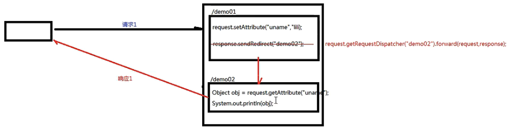

thymeleaf-dev

1.保存作用域
    
    原始情况下，有四个保存作用域：
    1) page         : 页面级别
    2) request      : 一次请求响应范围
客户端重定向：

服务器内部转发：

    3) session      : 一次会话范围
客户端重定向：

服务器内部转发：

    4) application  : 整个应用范围
