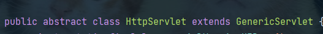
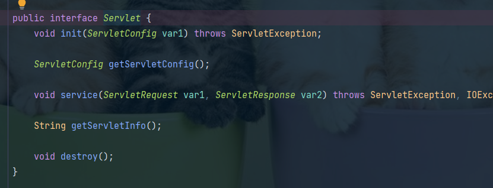

## web practice

  本项目主要是fisher自用，对java web的各种基础知识
的学习，和小项目的练习。

##### 一、servlet相关

###### 1、servlet继承关系

java.servlet.HttpServlet类 --继承-->

java.servlet.GenericServlet 抽象类 --实现-->
javax.servlet.Servlet接口

###### 2、servlet核心API

1) javax.servlet.Servlet;

        public interface Servlet{
            //初始化方法
            void init(ServletConfig var1) throws ServletException;
            
            //获取服务配置
            ServletConfig getServletConfig();
            
            //服务方法
            void service(ServletRequest var1,, ServletResponse var2) throws ServletException,IOException; 
            
            //获取服务信息
            String getServletInfo();
            
            //销毁服务方法
            void destroy();
        }

2) javax.servlet.GenericServlet;  (abstract)
        
        public abstract void service(ServletRequest var1, ServletResponse var2) throws ServletException,IOException;
        
3) javax.servlet.HttpServlet; (实体类)
      
         protected void service()HttpServletRequest req, HttpServletRequest resp) throws ServletException, IOException,IOException{
            //获取请求方式
            String method = req.getMethod(); 
            //判断请求方式类型,调用不同的doXX方法
            if(method.equals("GET")){...}
            else if (method.equals("POST")){...}
            else if (method.equals("DELETE")){...}
            else if (method.equals("PUT")){...}
            else if (method.equals("TRACE")){...}
            else{...}
         }
   
         protected void doPost(HttpRequest request, HttpResponse response) throws ServerException, IOException{
            String msg = lStrings.getString("http.method_post_not_supported");
            this.sendMethodNotAllowed(request, response,msg);
         }

###### 3、servlet生命周期

1) servlet生命周期对应Servlet接口中三个方法

   ①init => 初始化
   
   ②service => 服务

   ③destroy => 销毁
