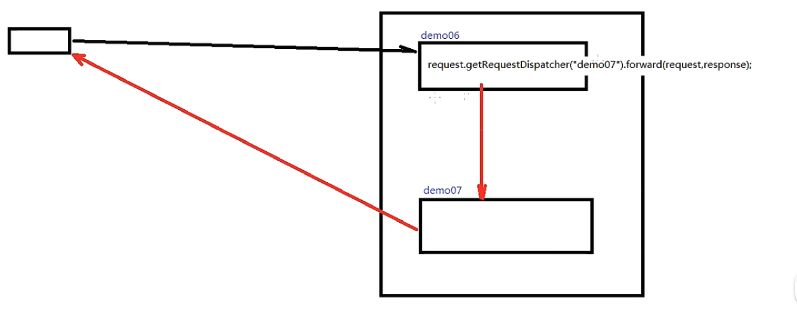
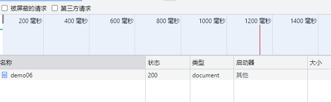
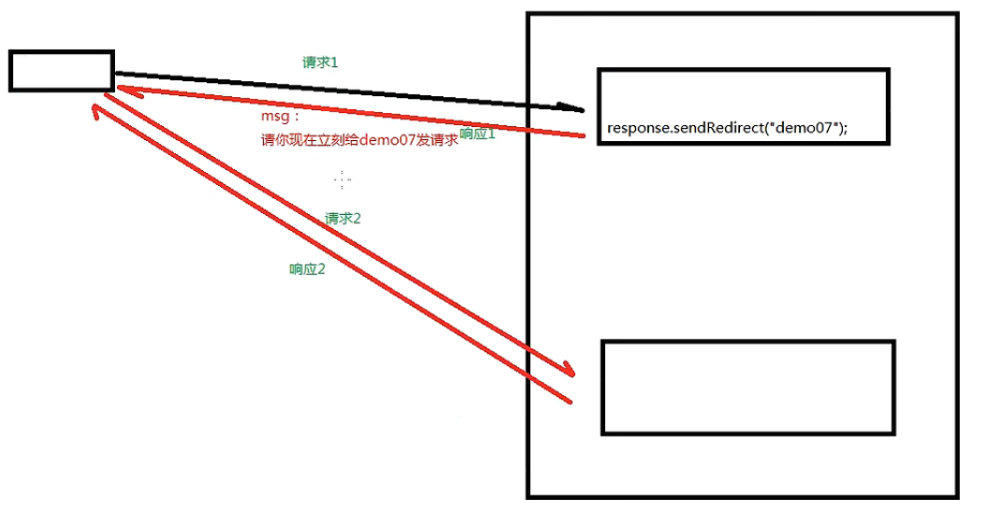
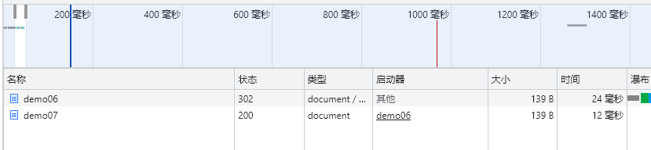

**1.设置编码**
    
    1)tomcat8之前，设置编码：

        ①get请求方式：
        e.g. String name = request.getParameter("name")");
             //将字符串打散成字节数组
             byte[] bytes = name.getBytes("ISO-8859-1");
             //将字节数组按照设定的编码重新组装成字符串
             name = new String(bytes,"UTF-8");

        ②post请求方式：
        e.g.  //post方式下设置编码，防止中文乱码
              request.setCharacterEncoding("utf-8");
    
    2)tomcat8开始，设置编码时只需对post请求方式设置编码
        e.g.  request.setCharacterEncoding("utf-8");

    **设置编码必须在所有的获取参数动作之前**

**2.servlet的继承关系**

    1)继承关系：
        javax.servlet.Servlet接口
            javax.servlet.GenericServlet抽象类 
                javax.servlet.http.HttpServlet
    
    public abstract class HttpServlet extends GenericServlet
    public abstract class GenericServlet implements Servlet, ServletConfig, Serializable
    public interface Servlet
    
    2)相关核心方法：
        
        ①javax.servlet.Servlet接口
        public interface Servlet {
            **初始方法**
            void init(ServletConfig var1) throws ServletException;
            
            ****
            ServletConfig getServletConfig();
            
            **服务方法**
            void service(ServletRequest var1, ServletResponse var2) throws ServletException, IOException;
            **若服务端有请求发出，tomcat容器会调用执行service方法**
            
            ****
            String getServletInfo();
            **销毁方法**
            void destroy();
        }
        
        ②javax.servlet.GenericServlet抽象类
            **服务方法**
            public abstract void service(ServletRequest var1, ServletResponse var2) throws ServletException, IOException;
            
        ③javax.servlet.http.HttpServlet抽象子类(extends GenericServlet)        
            **服务方法**
            protected void service(HttpServletRequest req, HttpServletResponse resp) throws ServletException,IOException { 
                //1.获取请求方式
                String method = req.getMethod();
                //2.判断请求方式类型,调用不同的doXX方法
            }
                **在HttpServlet类中，doXX方法都类似**
                e.g. doPost方法
                protected void doPost(HttpServletRequest req, HttpServletResponse resp) throws ServletException, IOException {
                    String msg = lStrings.getString("http.method_post_not_supported");
                    this.sendMethodNotAllowed(req, resp, msg);
                }
    
    
**3.servlet的生命周期**
    
    1)servlet生命周期对应servlet中的三个方法
        初始化：init();
        服务：service();
        销毁：destroy();

    2）默认情况下：
        ①servlet第一次接收请求时，会进行实例化(调用构造器)初始化(调用init方法),然后服务(调用service方法)；
        ②从第二次请求开始后，每一次都是服务；
        ③当容器（tomcat）关闭时，其中的所有的servlet实例都会被调用销毁方法（被销毁）。

    3)servlet实例对象，tomcat只能创建一个，所有的请求都是通过者一个实例去响应。
        优势：提高系统的启动速度；
        缺陷：初次请求耗费时间较长。
        **若需提高提升系统的启动速度：当前默认设置。**
        **若需提高系统的响应速度：应设置servlet的响应时机,即初始化时机。**
    
    4)servlet的初始化时机;

        ①默认情况下：初次接收请求是时初始化

        ②可设置：
            通过<load-on-startup>int</loard-on-startup>设置servlet启动的顺序。
            int越小，启动越靠前，最小值为0
            延长tomcat启动时间，但提升响应速度。

    5)servlet在容器中是单例的、线程不安全的。
        
        ①单例：所有的请求都是同一个实例去响应
        ②线程不安全：会发生与时间有关的错误
        
        **不建议在servlet中定义成员变量。
        若已经定义，则：不要修改成员变量的值;不要使用成员变量进行逻辑判断**

**4.http协议**
    
  HTTP：Hyper Text Transfer Protocol 超文本传输协议。

  HTTP最大的作用就是确定了请求和响应数据的格式。

  浏览器发送给服务器的数据：请求报文；服务器返回给浏览器的数据：响应报文。
 
    1)Http request : Http请求报文
    
        ①请求行 : 展示当前请求的最基本的信息
            请求方式/访问地址(url) HTTP协议的版本（1.1或1.0）
            e.g. POST/dynamic/hello.jsp HTTP/1.1
    
        ②请求消息头 : 通过具体的参数对本次请求进行详细的说明
    
        ③请求体 : 作为request的主题，发送数据给服务器（POST请求方式下的请求参数）
            POST请求方式有请求体，form data : 当前请求体是一个表单提交的请求参数

            GET请求方式下没有请求体，但有QueryString(查询字符串)
            
            JSON请求方式有请求体，request payload
    
    2)Http response : Http响应报文
        
        ①响应状态行：
            响应协议 响应状态码 响应状态(OK)
            e.g. HTTP/1.1 200 OK

        ②响应消息头：响应体的说明书（服务器发送给浏览器的信息简介）

        ③响应体：响应的实际内容（服务器返回的数据主题）

**5.会话**
    
    1)Http是无状态的

        服务器无法判断每次请求是否是同一个或者是多个客户端发送的。
        
        无状态现实问题:
            用户在网站购买商品，发送两次请求
            请求1是添加商品到购物车，请求2是是结账
            若服务器无法区分这两次请求是同一个用户的，则会产生混乱
        
        解决无状态问题：会话跟踪技术
    
    2)会话跟踪技术(利用Session)
        客户端首次发送请求给服务器时，服务器获取不到Session，则创建新的Session对象，并响应给客户端。
        客户端再次访问时，服务器就能分辨各个客户端

    3)常用API：
        request.getSession() -> 获取当前会话，没有则创建一个新会话
        request.getSession(true) -> 作用同上相同
        request.getSession(false) -> 获取当前会话，没有则返回null,不会创建新会话
        
        session.getId() -> 获取Session id（全局唯一码）
        session.isNew() -> 判断当前Session对象是否是新创建的
        session.getMaxInactiveInterval() -> session对象的非激活间隔时长，默认为1800s
        session.setMaxInactiveInterval(int i) -> 设置session对象的非激活间隔时长    
        session.invalidate() -> 强制使Session对象立即失效
    
    4)Session对象保存作用域
        常用API：
        void session.setAttribute(K,V)  -> 设置保存作用域 
        Object session.getAttribute(K)  -> 获取保存作用的值
        void session.removeAttribute(K) -> 删除保存作用域中的键值对
        

首次访问后输出

![img_2.png]

多次刷新页面后输出

![img_3.png]

6.服务器内部转发以及客户端定向
    
    1)服务器内部转发：request.getRequestDispatcher("...").forward(request,response);

    地址栏不改变,一次请求响应的过程，对于客户端而言，不知道内部经过了多少次转发

    2)客户端重定向：response.sendRedirect("...");

    地址栏改变，多次请求响应的过程，客户端知道url有变化

**7.Themeleaf**

**8.状态码**

    1) 500 :表示服务器内部错误
    2) 200 :正常响应
    3) 404 :找不到资源
    4) 405 :请求方式不支持