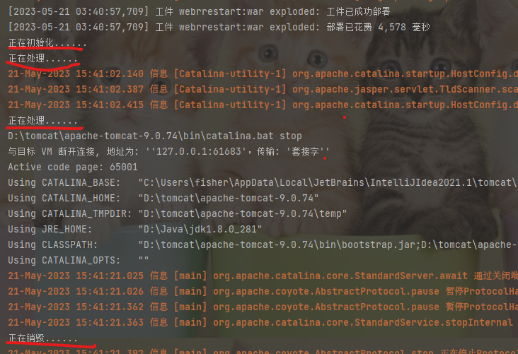
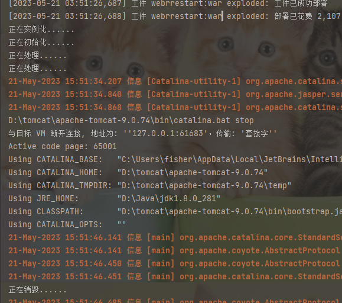

**1.设置编码**
    
    1)tomcat8之前，设置编码：

        ①get请求方式：
        e.g. String name = request.getParameter("name")");
             //将字符串打散成字节数组
             byte[] bytes = name.getBytes("ISO-8859-1");
             //将字节数组按照设定的编码重新组装成字符串
             name = new String(bytes,"UTF-8");

        ②post请求方式：
        e.g.  //post方式下设置编码，防止中文乱码
              request.setCharacterEncoding("utf-8");
    
    2)tomcat8开始，设置编码时只需对post请求方式设置编码
        e.g.  request.setCharacterEncoding("utf-8");

    **设置编码必须在所有的获取参数动作之前**

**2.servlet的继承关系**

    1)继承关系：
        javax.servlet.Servlet接口
            javax.servlet.GenericServlet抽象类 
                javax.servlet.http.HttpServlet
    
    public abstract class HttpServlet extends GenericServlet
    public abstract class GenericServlet implements Servlet, ServletConfig, Serializable
    public interface Servlet
    
    2)相关核心方法：
        
        ①javax.servlet.Servlet接口
        public interface Servlet {
            **初始方法**
            void init(ServletConfig var1) throws ServletException;
            
            ****
            ServletConfig getServletConfig();
            
            **服务方法**
            void service(ServletRequest var1, ServletResponse var2) throws ServletException, IOException;
            **若服务端有请求发出，tomcat容器会调用执行service方法**
            
            ****
            String getServletInfo();
            **销毁方法**
            void destroy();
        }
        
        ②javax.servlet.GenericServlet抽象类
            **服务方法**
            public abstract void service(ServletRequest var1, ServletResponse var2) throws ServletException, IOException;
            
        ③javax.servlet.http.HttpServlet抽象子类(extends GenericServlet)        
            **服务方法**
            protected void service(HttpServletRequest req, HttpServletResponse resp) throws ServletException,IOException { 
                //1.获取请求方式
                String method = req.getMethod();
                //2.判断请求方式类型,调用不同的doXX方法
            }
                **在HttpServlet类中，doXX方法都类似**
                e.g. doPost方法
                protected void doPost(HttpServletRequest req, HttpServletResponse resp) throws ServletException, IOException {
                    String msg = lStrings.getString("http.method_post_not_supported");
                    this.sendMethodNotAllowed(req, resp, msg);
                }
    
    
**3.servlet的生命周期**
    
    1)servlet生命周期对应servlet中的三个方法
        初始化：init();
        服务：service();
        销毁：destroy();
    

    2）默认情况下：
        ①servlet第一次接收请求时，会进行实例化(调用构造器)初始化(调用init方法),然后服务(调用service方法)；
        ②从第二次请求开始后，每一次都是服务；
        ③当容器（tomcat）关闭时，其中的所有的servlet实例都会被调用销毁方法（被销毁）。
    

    3)servlet实例对象，tomcat只能创建一个，所有的请求都是通过者一个实例去响应。
        优势：提高系统的启动速度；
        缺陷：初次请求耗费时间较长。
        **若需提高提升系统的启动速度：当前默认设置。**
        **若需提高系统的响应速度：应设置servlet的响应时机,即初始化时机。**
    
    4)servlet的初始化时机;

        ①默认情况下：初次接收请求是时初始化

        ②可设置：
            通过<load-on-startup>int</loard-on-startup>设置servlet启动的顺序。
            int越小，启动越靠前，最小值为0
            延长tomcat启动时间，但提升响应速度。

    5)servlet在容器中是单例的、线程不安全的。
        
        ①单例：所有的请求都是同一个实例去响应
        ②线程不安全：会发生与时间有关的错误
        
        **不建议在servlet中定义成员变量。
        若已经定义，则：不要修改成员变量的值;不要使用成员变量进行逻辑判断**

**4.http协议**

**5.会话**

**6.Themeleaf**

**7.error code**

    1) 500 :表示服务器内部错误